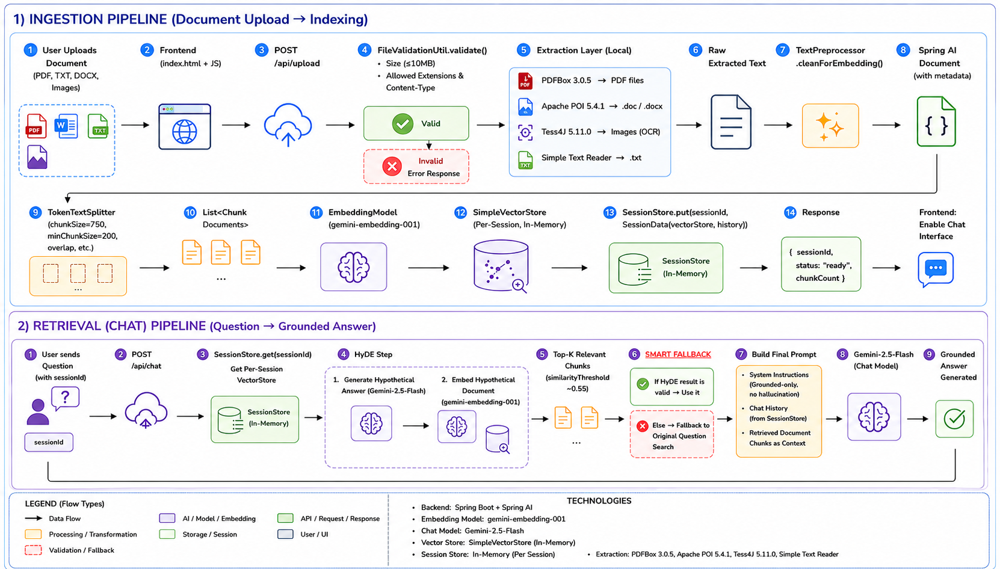

# SRAI - Spring Retrieval AI 🧠

---

<div align="center">

[](https://www.oracle.com/java/)
[](https://spring.io/projects/spring-boot)
[](https://spring.io/projects/spring-ai)
[](https://maven.apache.org/)
[](https://ai.google.dev/)
[](https://www.postman.com/)

</div>

---

> 🎯 Ask questions about your documents and get answers grounded in the provided content — not in random outside knowledge.

A modern **Retrieval-Augmented Generation (RAG)** application that demonstrates how to build document-grounded AI assistants. This project combines **Spring Boot**, **Spring AI**, and **Google Gemini** to create a system that retrieves relevant document chunks and answers questions using only the provided context.

---

## 📚 Table of Contents

- [Key Features](#-key-features)
- [How It Works](#-how-it-works)
- [Tech Stack](#-tech-stack)
- [Getting Started](#-getting-started)
- [API Reference](#api-reference)
- [Testing with Postman](#-testing-with-postman)
- [Project Structure](#-project-layout)
- [Troubleshooting](#troubleshooting)
- [License](#license)

---

## ✨ Key Features

- **Document-Grounded Answers** — Gemini responds only from your provided documents, not from general knowledge
- **Local Vector Store** — Embeddings are cached locally in `vectorstore.json`, so no recomputation on every startup
- **Production-Ready Code** — Clean Spring Boot config, dependency injection, and best practices
- **Easy to Extend** — Simple to add more documents or swap embeddings/chat models
- **Flexible Content** — Works with any text document (legal docs, research papers, knowledge bases, etc.)
- **No External Vector Databases** — Uses only Spring AI and Google Gemini APIs

---

## 🚀 What it does

```
┌─ User asks question
│
├─ App embeds the question
│
├─ Vector store retrieves similar chunks
│
├─ Chunks sent as context to Gemini
│
└─ Gemini responds using only the context
```

The endpoint at `GET /rag/models` accepts a message parameter and:

1. translates your question into a vector embedding
2. searches the vector store for matching document chunks
3. passes those chunks as context to Gemini
4. returns Gemini's grounded response based on the retrieved context

---

## 🧠 How it works

### Pipeline Overview



### 1️⃣ Document ingestion on startup

When the app starts, `RagConfig` checks whether a persisted vector store exists:

| Scenario | Action |
|----------|--------|
| Vector store exists | Load it immediately from `vectorstore.json` |
| Vector store missing | Read document → tokenize → embed → persist |

If the vector store is being built for the first time:

1. Read your document from `src/main/resources/data/document.txt` (currently using an example document)
2. Split it into smaller, overlapping chunks using token-based splitting
3. Generate embeddings for each chunk using Gemini's embedding model
4. Store the embeddings locally in `vectorstore.json`

### 2️⃣ Question answering flow

When you call `GET /rag/models?message=your_question`:

1. **Embed** — Your question is converted to a vector
2. **Retrieve** — The vector store finds the k most similar document chunks
3. **Augment** — Those chunks are injected into the prompt as context
4. **Generate** — Gemini reads the context and answers your question

The system prompt ensures the model:
- answers only from the provided context
- avoids using external knowledge
- admits when the documents don't contain enough information

---

## 🛠️ Tech stack

- **Java 21**
- **Spring Boot 4.0.6**
- **Spring AI 2.0.0-M7**
- **Spring Web MVC**
- **Google GenAI / Gemini**
  - chat model: `gemini-2.5-flash`
  - embedding model: `gemini-embedding-001`
- **SimpleVectorStore** for local persistence

---

## 📁 Project layout

```
SRAI/                                              # Root directory
│
├── src/
│   ├── main/
│   │   ├── java/
│   │   │   └── com/example/rag/                 # Application Source Code
│   │   │       ├── RagApplication.java          # Spring Boot application entry point
│   │   │       ├── RagConfig.java               # Vector store & document loading config
│   │   │       └── ModelController.java         # REST endpoint handler (@RestController)
│   │   │
│   │   └── resources/
│   │       ├── application.properties           # Spring Boot & Gemini API configuration
│   │       ├── data/                            # Document storage directory
│   │       │   ├── document.txt                 # Example text document for retrieval
│   │       │   └── vectorstore.json            # Persisted vector embeddings (auto-generated)
│   │       │
│   │       └── images/                          # Visual assets & diagrams
│   │           └── pipeline.png                 # RAG pipeline architecture diagram
│   │
│   └── test/
│       └── java/
│           └── com/example/rag/
│               └── RagApplicationTests.java    # Unit tests for the application
│
├── pom.xml                                       # Maven project configuration & dependencies
├── mvnw & mvnw.cmd                              # Maven Wrapper scripts (Linux/macOS & Windows)
├── README.md                                     # Project documentation
└── .gitignore                                    # Git ignore rules

```

### Key Directories Explained

| Directory | Purpose |
|-----------|---------|
| `src/main/java/com/example/rag/` | Core application logic - controllers, config, main app class |
| `src/main/resources/data/` | Your document files (text files) and generated vector store |
| `src/main/resources/images/` | Diagrams and visual documentation |
| `src/test/java/com/example/rag/` | Unit and integration tests |
| `target/` | Compiled classes and build artifacts (generated by Maven) |

---

## ✅ Requirements

To run the app, you'll need:

- **JDK 21**
- **Maven** or the included Maven Wrapper
- a valid **Google Gemini API key**
- a valid **Google GenAI Project ID**
- internet access for Gemini API calls

---

## 🔧 Configuration

The app requires two environment variables for Google Gemini API access:

### API Key

```bash
GEMINI_API_KEY
```

### Project ID

```bash
GOOGLE_GENAI_PROJECT_ID
```

Both are used in `src/main/resources/application.properties` for both chat and embedding requests.

**On Windows (PowerShell):**

```powershell
$env:GEMINI_API_KEY = "your-api-key-here"
$env:GOOGLE_GENAI_PROJECT_ID = "your-project-id-here"
```

**On Windows (Command Prompt):**

```cmd
set GEMINI_API_KEY=your-api-key-here
set GOOGLE_GENAI_PROJECT_ID=your-project-id-here
```

**On macOS/Linux:**

```bash
export GEMINI_API_KEY=your-api-key-here
export GOOGLE_GENAI_PROJECT_ID=your-project-id-here
```

---

## ▶️ Getting Started

### 1. Clone the repository

```bash
git clone https://github.com/JayitaSd/SRAI.git
cd SRAI
```


### 2. Prepare your document

Place your text document in `src/main/resources/data/` directory. The default example uses a sample file, but you can replace it with your own:

- Legal documents
- Research papers
- Knowledge bases
- Technical documentation
- Any other text content

### 3. Set your API key and Project ID

**On Windows (PowerShell):**

```powershell
$env:GEMINI_API_KEY = "your-api-key-here"
$env:GOOGLE_GENAI_PROJECT_ID = "your-project-id-here"
```

**On Windows (Command Prompt):**

```cmd
set GEMINI_API_KEY=your-api-key-here
set GOOGLE_GENAI_PROJECT_ID=your-project-id-here
```

**On macOS/Linux:**

```bash
export GEMINI_API_KEY=your-api-key-here
export GOOGLE_GENAI_PROJECT_ID=your-project-id-here
```

### 4. Run the application

**Using Maven Wrapper (all platforms):**

```bash
./mvnw spring-boot:run
```

**Or on Windows using the batch script:**

```powershell
mvnw.cmd spring-boot:run
```

### 5. Verify it's running

You should see output like:

```
2026-05-27 10:15:23.123  INFO 12345 --- [main] com.example.rag.RagApplication          : Started RagApplication in 5.234 seconds
```

The app will be available at `http://localhost:8080`

---

## API Reference

### Endpoint: Ask a question

**Request:**
```http
GET /rag/models?message=your+question+here
```

**Parameters:**

| Name | Type | Required | Description |
|------|------|----------|-------------|
| message | string | Yes | Your question about the document content |

**Example:**
```bash
curl "http://localhost:8080/rag/models?message=What%20are%20the%20key%20points%20from%20the%20document%3F"
```

**Response:**
```
A text response grounded in your document, or a message stating that the documents do not contain enough information.
```

**Example response:**
```
Based on the provided document, the key points are: [Relevant information extracted from your document]...
```

---

## 🧪 Testing with Postman

[Postman](https://www.postman.com/) is a great tool for testing REST APIs. Follow these steps to test the SRAI endpoint:

### 1. Download and Install Postman

Visit [postman.com](https://www.postman.com/downloads/) to download Postman for your operating system.

### 2. Create a New Request

- Open Postman
- Click **+ New** → **HTTP Request**
- Set the request type to **GET**

### 3. Enter the Endpoint URL

In the URL field, enter:
```
http://localhost:8080/rag/models?message=YOUR_QUESTION_HERE
```

Or use the **Params** tab:
- **Key:** `message`
- **Value:** `What are the key points from the document?`

### 4. Send the Request

Click the **Send** button. You should receive a response containing the answer grounded in your document.

### 5. Example Postman Workflow

| Step | Action |
|------|--------|
| Method | `GET` |
| URL | `http://localhost:8080/rag/models` |
| Params (Key) | `message` |
| Params (Value) | `What is discussed in the document?` |
| Click | **Send** |

### Alternative: Using cURL

If you prefer command-line testing, use cURL:

```bash
curl -X GET "http://localhost:8080/rag/models?message=What%20is%20discussed%20in%20the%20document%3F"
```

---

## 💡 Tips & Best Practices

- **Vector Store Caching** — The vector store is persisted locally, so the app loads embeddings from disk on subsequent startups. This is much faster than regenerating them.
- **Updating Your Document** — If you modify your document, delete the `vectorstore.json` file so the app regenerates embeddings from the new content on the next startup.
- **Adding Multiple Documents** — You can easily add more documents by modifying `RagConfig.java` to load multiple text files and combine them in the vector store.
- **Model Tuning** — Adjust the Gemini model or the max output tokens in `application.properties` to customize the response behavior.
- **Custom System Prompts** — Edit the system instructions in `ModelController.java` to change how the model responds to your specific use case.

---

## Troubleshooting

### Issue: "API key is not valid"

**Solution:**
- Verify that `GEMINI_API_KEY` environment variable is set correctly
- Check that your Google Gemini API key is valid and has the right permissions
- Restart your terminal/IDE after setting the environment variable

### Issue: "Project ID is not valid" or "Invalid project-id"

**Solution:**
- Verify that `GOOGLE_GENAI_PROJECT_ID` environment variable is set correctly
- Ensure the Project ID matches your Google Cloud project
- Check that the project has Gemini API enabled
- Restart your terminal/IDE after setting the environment variable

### Issue: "Vector store file not found" or embeddings aren't loading

**Solution:**
- Ensure your document exists in `src/main/resources/data/`
- Delete `vectorstore.json` to force regeneration
- Check that the app has write permissions to the `src/main/resources/data/` directory

### Issue: "Document not found" or content not being retrieved

**Solution:**
- Verify your document file is placed in `src/main/resources/data/`
- Check the file name matches the configuration in `RagConfig.java`
- Ensure the document is in plain text format (.txt)
- Delete `vectorstore.json` and restart to reprocess the document

### Issue: Slow first startup

**Cause:** The first run generates embeddings for all document chunks, which takes time depending on document size and API latency.

**Solution:** This is normal. Subsequent runs will be much faster because embeddings are cached.

### Issue: "Port 8080 is already in use"

**Solution:**
```bash
# Change the port in application.properties or via environment variable:
java -Dserver.port=8081 -jar target/RAG-0.0.1-SNAPSHOT.jar
```

---

## 🎯 In short

This project is a compact, real-world example of how to build a document-grounded AI assistant with Spring Boot, Spring AI, and Gemini. Use it as a foundation for your own RAG applications with any type of document content you need.
